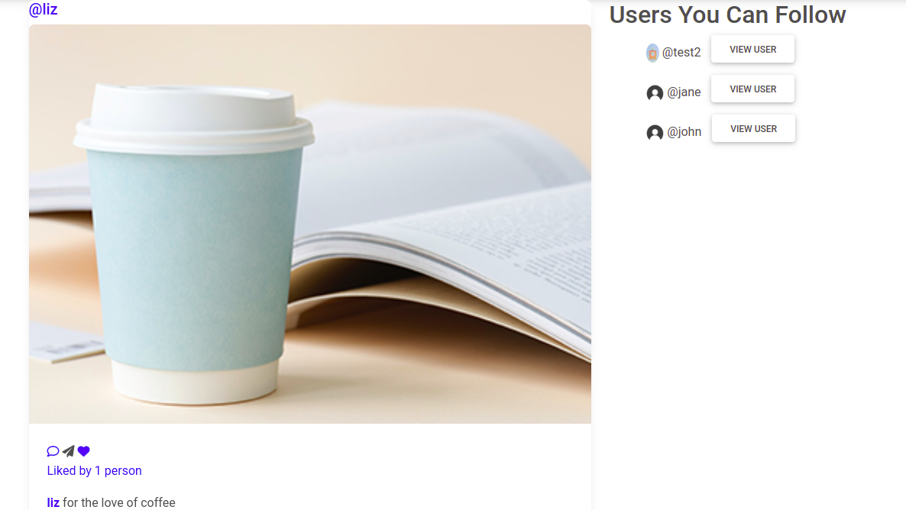

# Instagram
This is an application that allows users to sign up,login then post pictures, get followers, follow other users and like  posts as well as update their profile.
Users can also search for other users by their username.

## Author
Elizabeth Adhiambo

## User Stories
A user of the application can:
* Sign in / login to the application to start using.
* Upload pictures to the application.
* See their profile with all their pictures.
* Follow other users and see their pictures on their timeline.
* Like a picture and leave  on it.

## Design

## Specifications
| Behaviour | Input | Output |
| :---------------- | :---------------: | ------------------: |
| Admin Authentication | **On demand** | Access Admin dashboard |
| User Authentication | **On demand, verify emails before proceeding** | Access Admin dashboard |
| Display all images  and likes | **Home page** | Clickable links to open any images in a modal |
| Display single images on modal | **On  click** | All details should be viewed|
| To add an image  | **Through Admin dashboard and homepage** | Click on add and upload respectively|
| To edit image  | **Through Admin dashboard** | Redirected to the  image form details and editing happens|
| To delete an image  | **Through Admin dashboard** | click on image object and confirm by delete button|
| To search  | **Enter text in search bar** | Users can search by username|
| View other users profiles  | click on users priofile photo/username to view profile | Users can view all images posted by any user|
| Like images | **Add likes to an image** | Users can add likes to images they like and also unlike an image|
| Follow users | **Follow another user** | Users can follow and unfollow other users depending on their interest|

## Technologies used
* Python3.8.10
* Django 

## Installations

The following command installs all the application requirements
>``pip freeze -r requirements.txt``

## Setup
Run 
``https://github.com/Liz2222/insta-gram.git``

or download the zip file from github.

After extracting the files, 

1. Navigate to the project folder
>`` cd name_of_folder`` 

2. Creating a virtual environment
>``virtualenv virtual``

3. Activating the virtual environment
>``source virtual/bin/activate``

4. Running the application
>``python3 manage.py runserverserver``

5. Running tests

 > ``python3 manage.py test.``

## [License]()

## Collaborate
For any collaborations, reach me on [adhiamboliz3@gmail.com]()